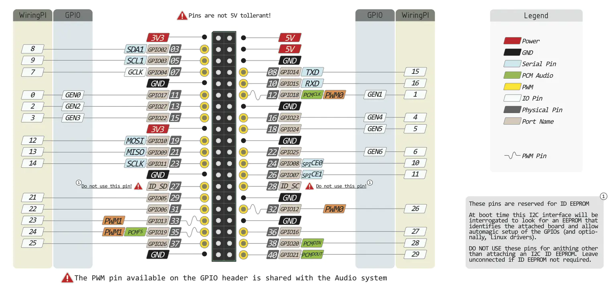
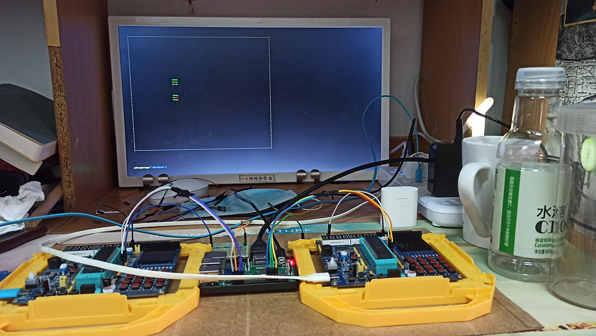

# Pi51

## About
> This is my Final Project of Course *Digital Logic and Microprocessor*

This is a Two-player **Battle City** game that uses Microcontroller(C51) as Client and uses Raspberry Pi as Server. C51 communicates with Raspberry Pi via voltage. The Raspberry Pi is connected to the PC via LAN, and then draws the game scene on the screen. The simulation of the game is carried out in the Raspberry Pi. The Raspberry Pi will process the input sent by the player and return the opponent’s input, game status, score, etc. to the player, and display it on the C51 LED light-emitting tube.

### 🛠Raspberry Pi GPIO

## Running

